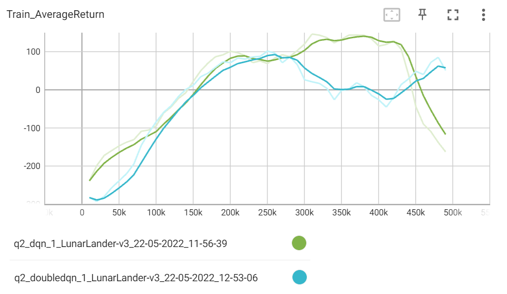
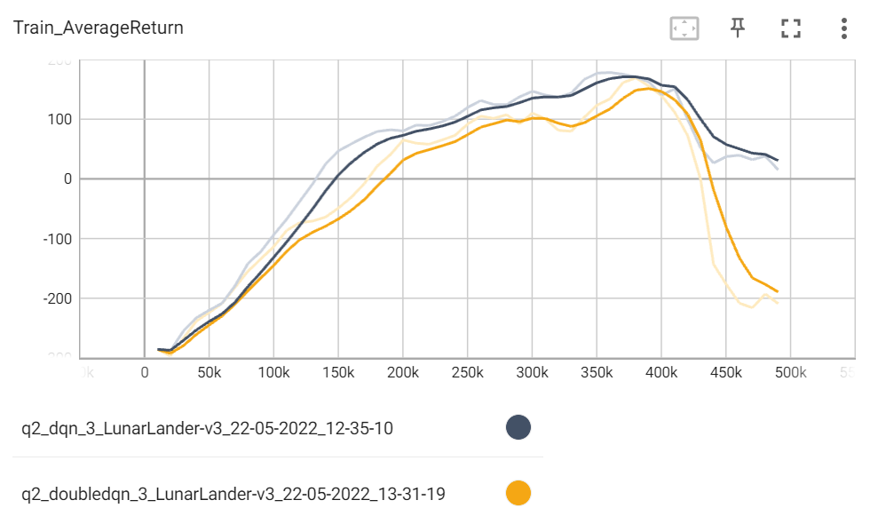
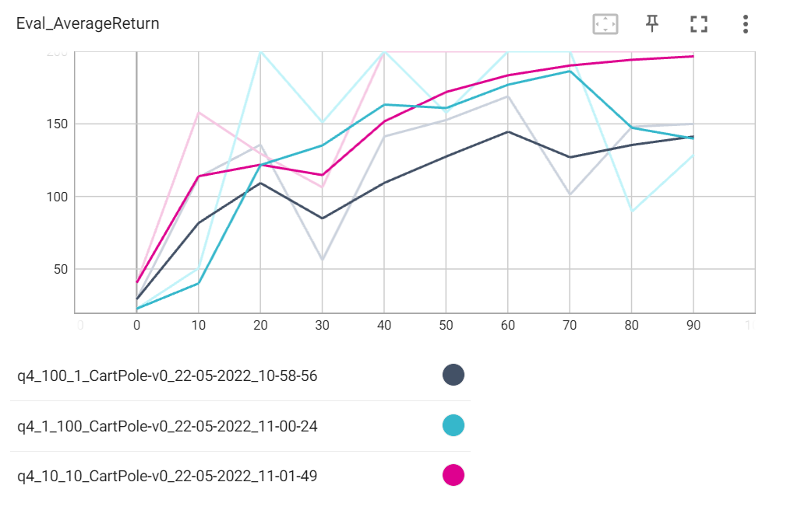
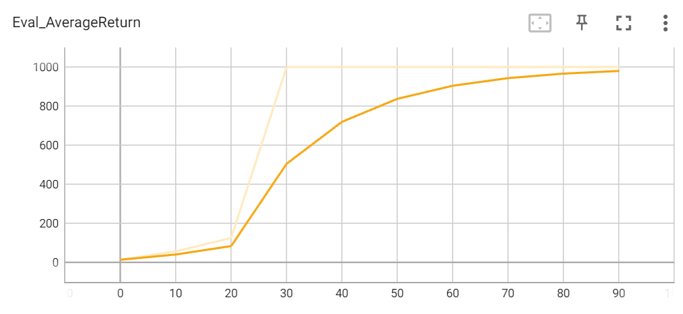
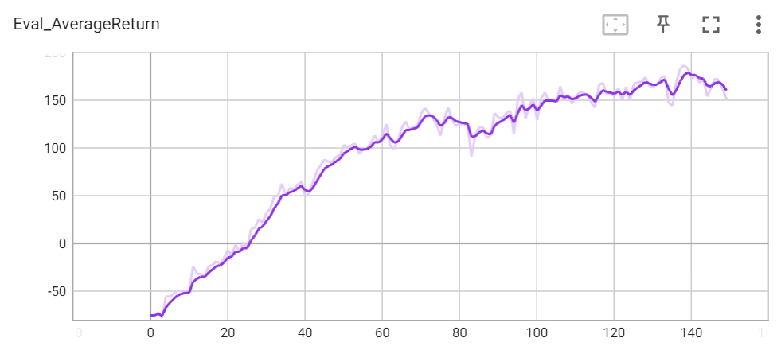

## 2. Практическая часть
#### Эксперимент 1: Base Q-learning
Кривые обучения реализации на Ms. Pac-Man:


Для проведения этого эксперимента был изменён гиперпараметр, отвечающий за число временных шагов:
```
num_timesteps = 1000000
```

#### Эксперимент 2: DQN vs DDQN
Ниже приведены графики со сравнением средних результатов алгоритмов DQN и DDQN в Lunar Lander.
При seed = 1:


При seed = 2:


При seed = 3:


#### Эксперимент 3: DQN hyperparameters
Эксперименты проводились в среде Lunar Lander, а в качестве гиперпараметра для исследования был выбран - batch_size.
С помощью этого параметра удалось незначительно изменить скорость выполнения алгоритма, хотя предполагалось, что разница будет существенной.
Ниже приведены графики при различном размере батча (32, 64, 128, 256):


Лучший результат был достигнут при batch_size = 64 и batch_size = 128.

#### Эксперимент 4: Sanity check with CartPole
Подбор наилучших параметров:


Из приведённых графиков видно, что наилучший результат получается при num_target_updates = 10, num_grad_steps_per_target_update = 10.

#### Эксперимент 5: Run actor-critic with more difficult tasks
График результатов для среды InvertedPendulum:


Видно, что после 100 итераций отдача находится на уровне 1000.

График результатов для среды HalfCheetah.:


Видно, что после 150 итераций отдача находится на уровне 150.